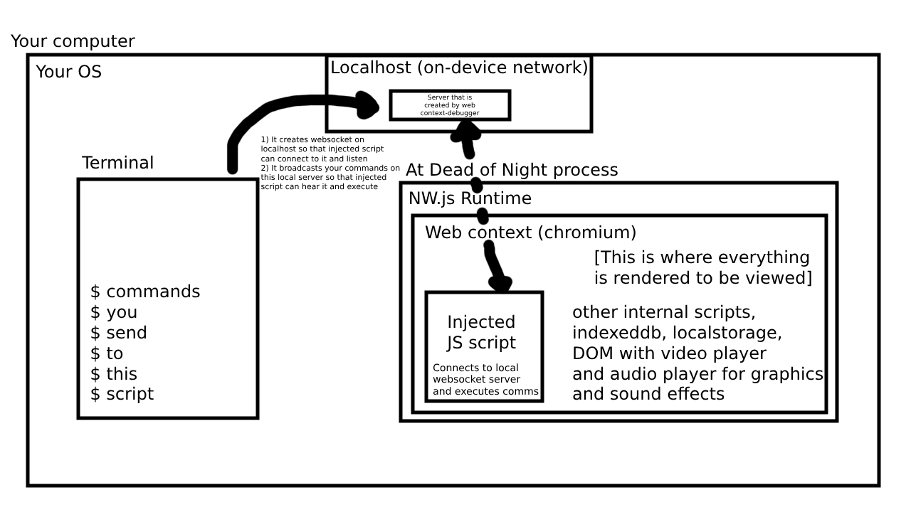

# At Dead of Night web context server

This tool connects to At Dead of Night internal webcontext (inside NW.js window) and acts as a simple server that sends arbitrary JavaScript code inside that webcontext and returns result.

This allows you to easily manipulate some of game's mechanics without analyzing and inspecting computer's memory variables (which is much harder and must be done with cheatengine and lua).

## How to use?

1. Add [debugger.js](https://github.com/AtDeadOfNight/russian-dub-release/blob/main/package.nw/debugger.js) to package.nw directory. Make sure to check if your local IP address matches one in the script, you may want to adjust it if you're running ADON in virtual machine and this script on host
2. Add import of this file to index.html as seen [here](https://github.com/AtDeadOfNight/russian-dub-release/blob/main/package.nw/index.html#L829)
3. Open terminal, clone web-context-debugger project somewhere, install dependencies to run it (`npm install`), then build (`npm run build`) and start (`npm start`)
4. Now open the game and wait for it to connect to the script. You should see message `↓ Connected from At Dead Of Night!`
5. You can now start to send commands and receive results. Feel free to adjust serializer and deserializer if you want to pass some complex objects or functions

## It does not connect

Make sure you specified correct local IP address. If you're running under VM make sure it it able to connect to host via host's IP. If you're using VPN, make sure it does not interfere with local networks IPs or turn it off.

You can make request to `http://yourip:10109/test`:
- If it returns `It works!` — you're good to go
- If it returns CONNECTION_REFUSED you're probably specified wrong IP
- If it loads too long and then times out, something like firewall is probably restricting you from accessing your machine from other hosts

On basically any OS you can run `curl http://ipaddress:10109/test` and if it returns something not red — it works!